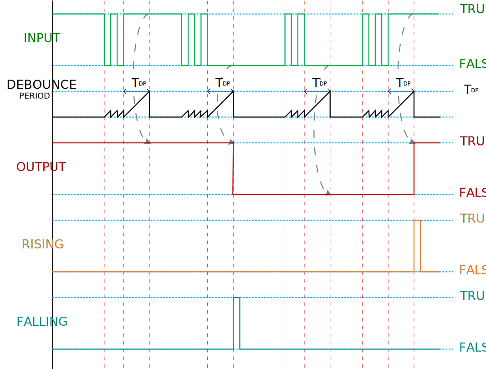

# Advanced-Debouncer
The advanced debounce removes the resulting ripple signal and provides a clean transition at its output with `delayed` and `instant` modes.

## Delayed Mode
The delayed mode responds to the signal to update the output when input is stable for the fully qualified debounce period.
<p align="center">
	
  <h3 align="center">Delayed Mode Timing Diagram</h3>
</p>

## Instant Mode
The instant mode provides an instant response to the first edge on the signal to update the output and wait for the input to stable for the fully qualified debounce period for the next update.

<p align="center">
	
  <h3 align="center">Instant Mode Timing Diagram</h3>
</p>


# Using of Advanced-Debouncer Class
## Header
```c
#include "ADebouncer.h"
```

## Declaration
```c
ADebouncer variableName;
```

### Example

```c
ADebouncer debouncer;
```

## Mode
### Syntax:
```c
variableNam.mode(debounce_t debounceMode, unsigned long debouncePeriod, bool initOutput);
```

### Parameters

*`debounceMode`*\
Debounce Mode.
  - *`DELAYED`*\
  Delay Mode
  - *`INSTANT`*\
  Instant Mode

*`debouncePeriod`*\
Debounce Period in milliseconds.

*`initOutput`*\
Initial output state.

### Example:
Define the debouncer in delayed mode with debounce period of 10 milliseconds and initial output with a HIGH state.

```c
debouncer.mode(DELAYED, 10, HIGH);
```

## Debounce
### Syntax:
```c
result = variable.debounce(input);
```

### Parameter
*`input` :`bool`*\
Bounce input.

### Return:
*`debounced` :`bool`*\
Get the debounced output state.

### Example:
```c
bool debounced = debouncer.debounce(digitalRead(buttonPin));
```

## Returns

### Debouncing
#### Syntax:
*`bool debouncing = variable.debouncing();`*\
Get the debouncing state.

#### Example:
```c
bool debouncing = debouncer.debouncing();
digitalWrite(LED_BUILTIN, debouncing);
```

Or,

```c
digitalWrite(LED_BUILTIN, debouncer.debouncing());
```

### Debounced
#### Syntax:
*`bool debounced = variable.debounced();`*\
Get the debounced state.

#### Example:
```c
bool debounced = debouncer.debounced();
digitalWrite(LED_BUILTIN, debounced);
```

Or,

```c
digitalWrite(LED_BUILTIN, debouncer.debounced());
```

### Rising Edge of the output
#### Syntax:
*`bool risingEdge = variable.rising();`*\
Get the rising edge of the output.

#### Example:
```c
bool risingEdge = debouncer.rising();
if (risingEdge) toggle = !toggle;
```

Or,

```c
if (debouncer.rising()) toggle = !toggle;
```

### Falling Edge of the output
#### Syntax:
*`bool fillingEdge = variable.falling();`*\
Get the falling edge of the output.

#### Example:
```c
bool fillingEdge = debouncer.falling();
if (fillingEdge) toggle = !toggle;
```

Or,

```c
if (debouncer.falling()) toggle = !toggle;
```

# Example
## Button
Declare debounce mode as delayed mode. Debounce the input signal from the button and update LED_BUILTIN with the debounced state.

Click [ here](examples/Button/Button.ino) the Button sketch.

## Toggle
Declare debounce mode as delayed mode. Debounce the input signal from the button. Toggle the state when pressing the button and update LED_BUILTIN with the toggle state.

Click [ here](examples/Toggle/Toggle.ino) the Toggle sketch.

## ResetSet
This example is designed to have a set button and a reset button to Reset-Set the state.
- Declare debouncer for the set button. set the debounce as a delayed mode
- Declare debouncer for the reset button. Set the debounce as an instant mode

Both set and reset buttons have the same debounce period. in this example, will be set to debounce period for 1 second,
- To set the state, press the set button for 1 second.
- To reset the state, the state will be instantly reset after pressing the reset button.

The LED_BUILTIN will be updated with the state value.

Click [ here](examples/ResetSet/ResetSet.ino) the ResetSet sketch.