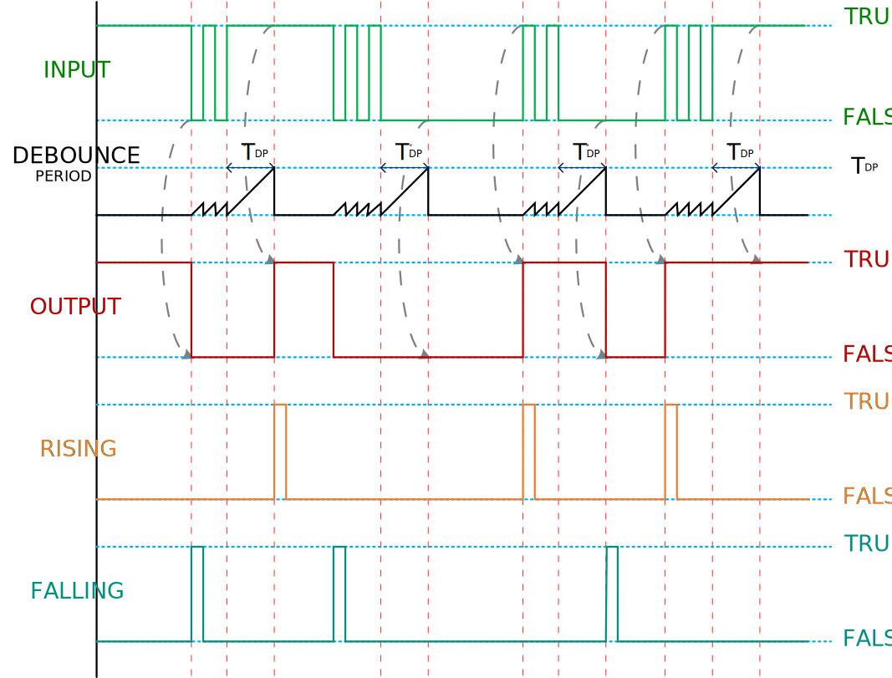

# Advanced-Debouncer
[](https://github.com/MicroBeaut/ADebouncer/actions/workflows/Arduino-Lint-Action.yml)
[](https://github.com/MicroBeaut/ADebouncer/actions/workflows/Spell-Check.yml)
[](https://github.com/MicroBeaut/ADebouncer/actions/workflows/Compile-Examples.yml)


The advanced debounce removes the resulting ripple signal and provides a clean transition at its output with `delayed` and `instant` modes.

## Delayed Mode
The delayed mode responds to the signal to update the output when input is stable for the fully qualified debounce period.
<p align="center">
	
  <h3 align="center">Delayed Mode Timing Diagram</h3>
</p>

## Instant Mode
The instant mode provides an instant response to the first edge on the signal to update the output and wait for the input to stable for the fully qualified debounce period for the next update.

<p align="center">
	
  <h3 align="center">Instant Mode Timing Diagram</h3>
</p>


# Using of Advanced-Debouncer Class
## Header
```c
#include "ADebouncer.h"
```

## Declaration
```c
ADebouncer variableName;
```

### Example

```c
ADebouncer debouncer;
```

## Mode
### Syntax:
```c
variableNam.setMode(debounce_t debounceMode, unsigned long debouncePeriod, bool initOutput);
```

### Parameters

*`debounceMode`*\
Debounce Mode.
  - *`DELAYED`*\
  Delay Mode
  - *`INSTANT`*\
  Instant Mode

*`debouncePeriod`*\
Debounce Period in milliseconds.

*`initOutput`*\
Initial output state.

### Example:
Define the debouncer in delayed mode with debounce period of 10 milliseconds and initial output with a HIGH state.

```c
debouncer.setMode(DELAYED, 10, HIGH);
```

## Debounce
### Syntax:
```c
result = variable.debounce(input);
```

### Parameter
*`input` :`bool`*\
Bounce input.

### Return:
*`debounced` :`bool`*\
Get the debounced output state.

### Example:
```c
bool debounced = debouncer.debounce(digitalRead(buttonPin));
```

## Returns

### Debouncing
#### Syntax:
*`bool debouncing = variable.isDebouncing();`*\
Get the debouncing state.

#### Example:
```c
bool debouncing = debouncer.isDebouncing();
digitalWrite(LED_BUILTIN, debouncing);
```

Or,

```c
digitalWrite(LED_BUILTIN, debouncer.isDebouncing());
```

### getDebouncedOutput
#### Syntax:
*`bool debounced = variable.getDebouncedOutput();`*\
Get the debounced state.

#### Example:
```c
bool debounced = debouncer.getDebouncedOutput();
digitalWrite(LED_BUILTIN, debounced);
```

Or,

```c
digitalWrite(LED_BUILTIN, debouncer.getDebouncedOutput());
```

### Rising Edge of the output
#### Syntax:
*`bool risingEdge = variable.isRisingEdge();`*\
Get the rising edge of the output.

#### Example:
```c
bool risingEdge = debouncer.isRisingEdge();
if (risingEdge) toggle = !toggle;
```

Or,

```c
if (debouncer.isRisingEdge()) toggle = !toggle;
```

### Falling Edge of the output
#### Syntax:
*`bool fallingEdge = variable.isFallingEdge();`*\
Get the falling edge of the output.

#### Example:
```c
bool fallingEdge = debouncer.isFallingEdge();
if (fallingEdge) toggle = !toggle;
```

Or,

```c
if (debouncer.isFallingEdge()) toggle = !toggle;
```

# Example
## Button
Declare debounce mode as delayed mode. Debounce the input signal from the button and update LED_BUILTIN with the debounced state.

Click [ here](examples/Button/Button.ino) the Button sketch.
```c
#include "ADebouncer.h"
 
#define BUTTON_INPUT_PIN 2    // Pin for the button input.
#define DEBOUNCE_PERIOD_MS 10 // Debounce period in milliseconds.
 
ADebouncer buttonDebouncer;   // Create a debouncer instance.
 
void setup() {
  pinMode(BUTTON_INPUT_PIN, INPUT_PULLUP);  // Set the button input pin as input with pull-up.
  pinMode(LED_BUILTIN, OUTPUT);             // Set the built-in LED pin as output.
  buttonDebouncer.setMode(DELAYED, DEBOUNCE_PERIOD_MS, HIGH); // Set debounce mode to delayed with a 10ms period, starting with a HIGH output.
}
 
void loop() {
  bool debouncedButtonState = buttonDebouncer.debounce(digitalRead(BUTTON_INPUT_PIN));  // Get the debounced button state.
  digitalWrite(LED_BUILTIN, debouncedButtonState);                                      // Update the built-in LED with the debounced button state.
}
```

## Toggle
Declare debounce mode as delayed mode. Debounce the input signal from the button. Toggle the state when pressing the button and update LED_BUILTIN with the toggle state.

Click [ here](examples/Toggle/Toggle.ino) the Toggle sketch.
```c
#include "ADebouncer.h"

#define BUTTON_INPUT_PIN 12     // Define the button input pin.
#define DEBOUNCE_PERIOD_MS 10   // Define the debounce period in milliseconds

ADebouncer buttonDebouncer;       // Declare debouncer variable.
bool state;                       // Declare state variable.

void setup() {
  pinMode(BUTTON_INPUT_PIN, INPUT_PULLUP);                      // Set the button mode as input pullup.
  pinMode(LED_BUILTIN, OUTPUT);                                 // Set the LED_BUILTIN mode as output.
  buttonDebouncer.setMode(DELAYED, DEBOUNCE_PERIOD_MS, HIGH);   // Set the debounce mode as delayed mode and debounce period, with the initial output in a HIGH state.
  state = HIGH;                                                 // Initial state is set to HIGH.
}

void loop() {
  buttonDebouncer.debounce(digitalRead(BUTTON_INPUT_PIN));  // Debounce input of the button state.
  if (buttonDebouncer.isFallingEdge()) state = !state;      // Toggle state of the state variable.
  digitalWrite(LED_BUILTIN, state);                         // Update LED_BUILTIN with the state.
}
```

## ResetSet
This example is designed to have a set button and a reset button to Reset-Set the state.
- Declare debouncer for the set button. set the debounce as a delayed mode
- Declare debouncer for the reset button. Set the debounce as an instant mode

Both set and reset buttons have the same debounce period. in this example, will be set to debounce period for 1 second,
- To set the state, press the set button for 1 second.
- To reset the state, the state will be instantly reset after pressing the reset button.

The LED_BUILTIN will be updated with the state value.

Click [ here](examples/ResetSet/ResetSet.ino) the ResetSet sketch.
```c
#include "ADebouncer.h"

#define SET_PIN          12       // Define the set input pin.
#define RESET_PIN        11       // Define the reset input pin.
#define DEBOUNCE_PERIOD_MS  1000  // Define the debounce period in milliseconds

ADebouncer setButton;       // Declare set debouncer variable.
ADebouncer resetButton;     // Declare reset debouncer variable.
bool state;                 // Declare state variable for ResetSet.

void setup() {
  pinMode(SET_PIN, INPUT_PULLUP);   // Set the button mode as input pullup.
  pinMode(RESET_PIN, INPUT_PULLUP); // Set the button mode as input pullup.
  pinMode(LED_BUILTIN, OUTPUT);     // Set the LED_BUILTIN mode as output.
  setButton.setMode(DELAYED, DEBOUNCE_PERIOD_MS, HIGH);    // Set the debounce mode as delayed mode and debounce period, with the initial output in a HIGH state.
  resetButton.setMode(INSTANT, DEBOUNCE_PERIOD_MS, HIGH);  // Set the debounce mode as instant mode and debounce period, with the initial output in a HIGH state.
  state = LOW;                                          // Initial state in a LOW state.
}

void loop() {
  // Debounce input of the set button state.
  setButton.debounce(digitalRead(SET_PIN));
  // Debounce input of the reset button state.
  resetButton.debounce(digitalRead(RESET_PIN));

  // Update the state based on set and reset button outputs.
  state = (state | !setButton.getDebouncedOutput()) & resetButton.getDebouncedOutput();
  // Update LED_BUILTIN with the state.
  digitalWrite(LED_BUILTIN, state);
}
```